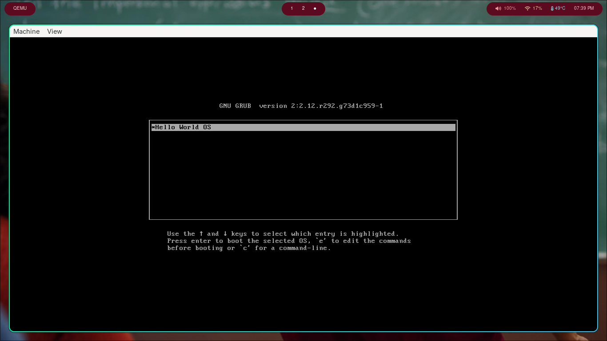
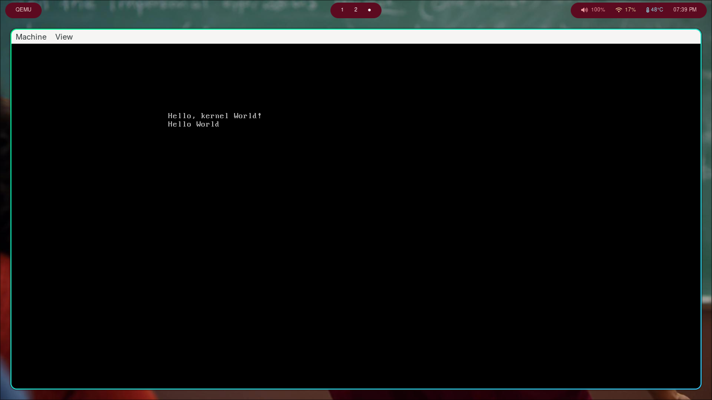

# Operating System

## Description

Simple Operating System which was created to learn how an operating system boots up!.

## HOW TO USE

1. Build an Cross Compiler for x86_i386 [https://osdev.wiki/wiki/GCC_Cross-Compiler]
2. Run "make" command to build the iso file.
3. Mount the iso in VM or qemu to load the Operating System

or

just use the prebuilt iso file from the releases 🙂

### Images

